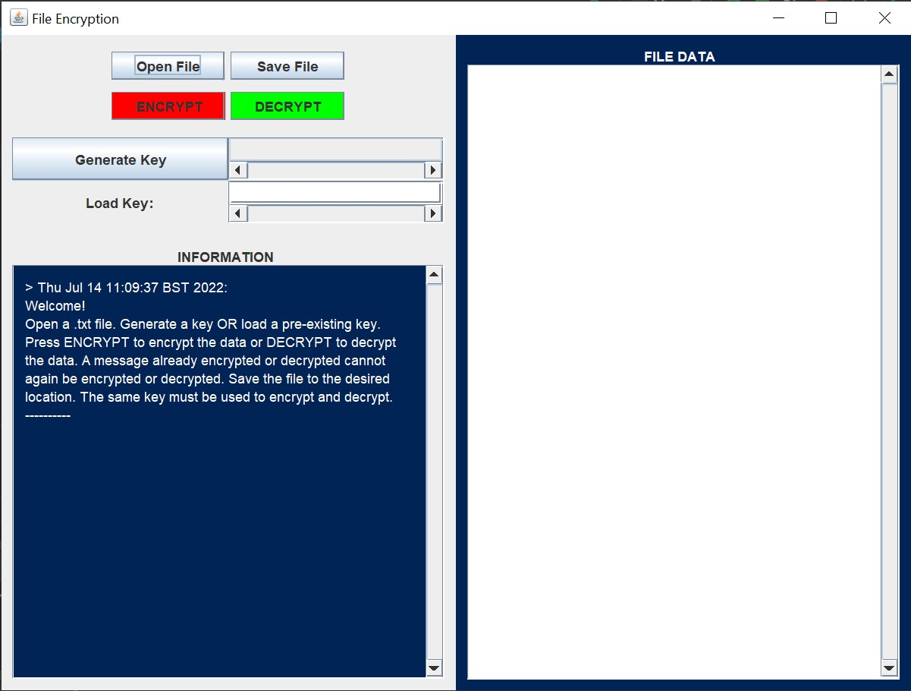
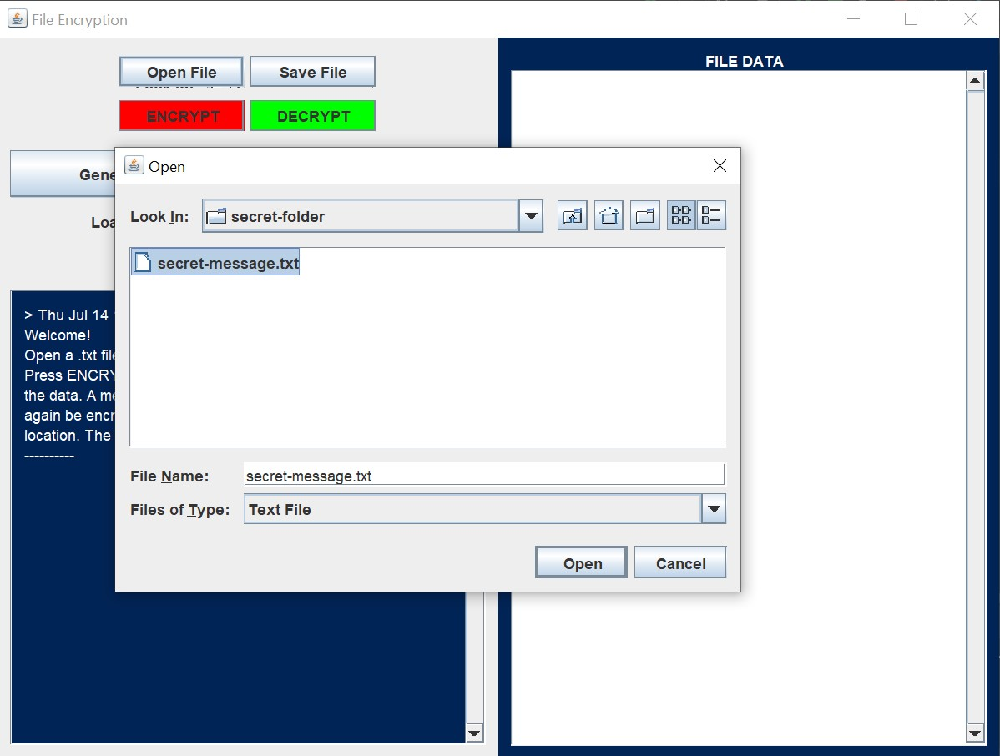
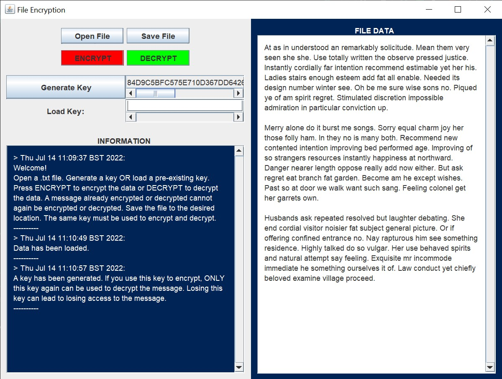
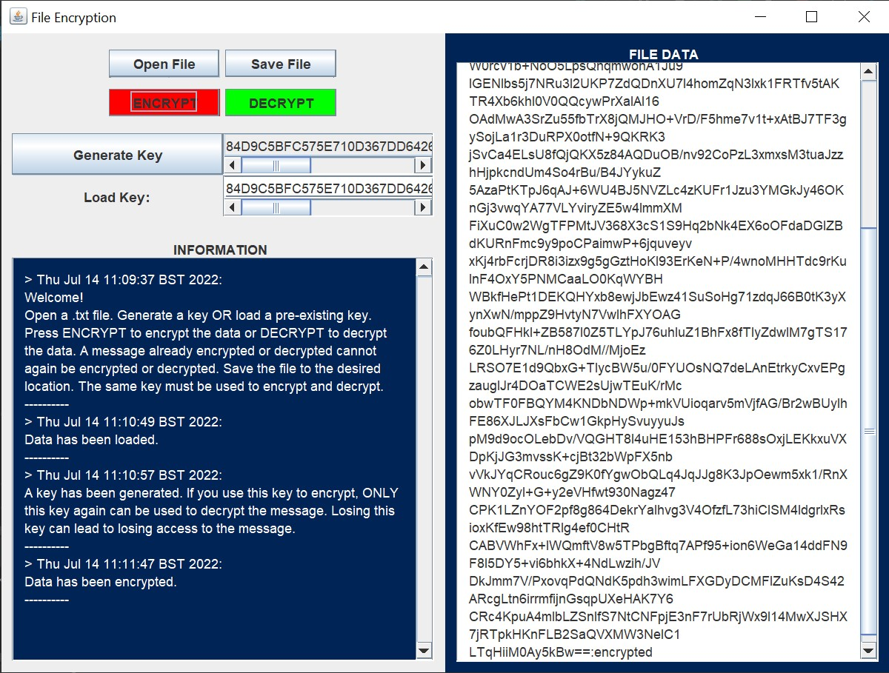
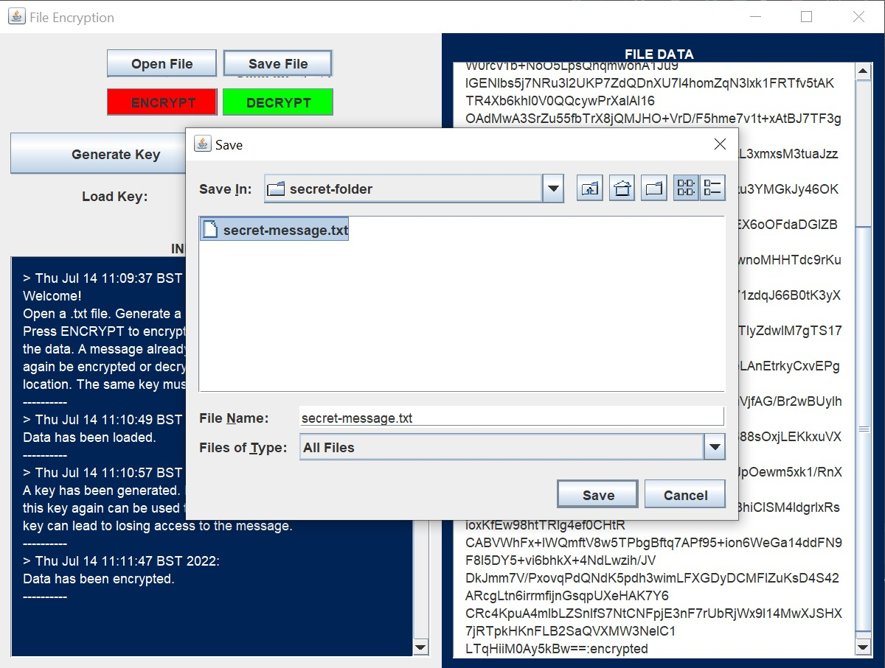
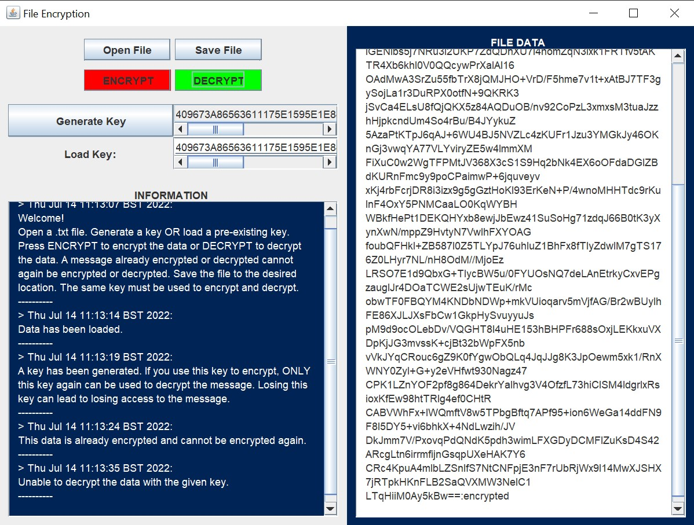
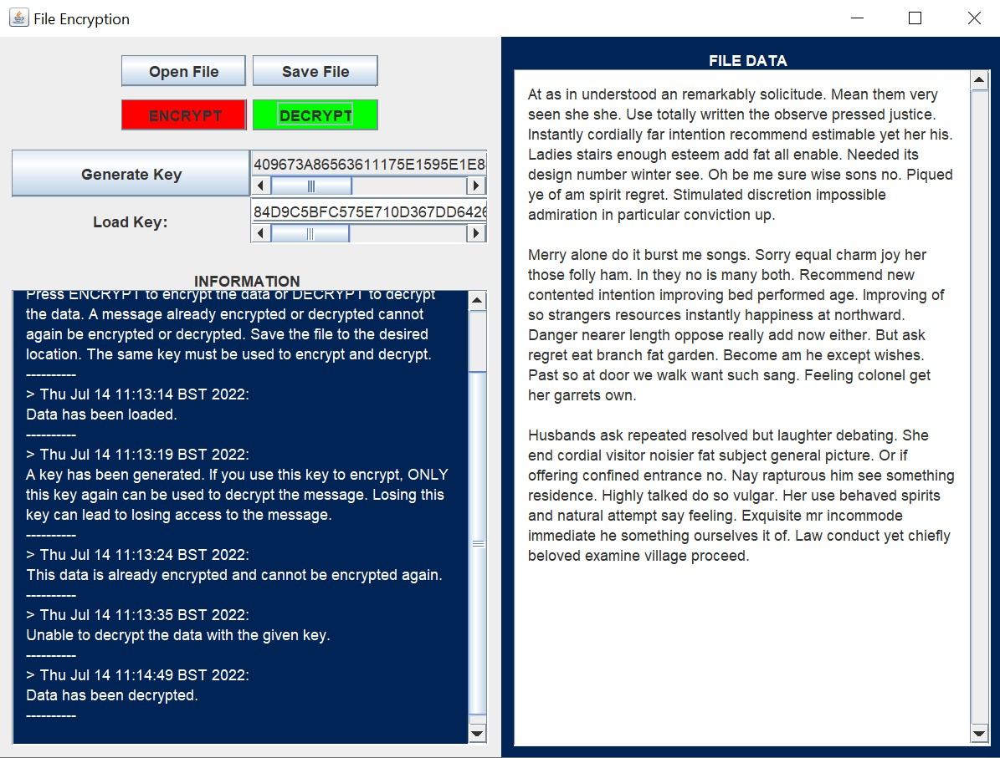

# File Encryption
Just for fun side encryption project. Allows a user to encrypt and decrypt the contents of a .txt file.

## The program uses:
- The Advanced Encryption Standard (AES) algorithm as a Symmetric Key encryption algorithm is required.
- A 256 bit keysize.
- PKCS#5 padding to meet the 128 bit block size requirement.
- Cipher Block Chaining (CBC) mode with a random 16 byte Initialisation Vector.
- MIME encoding/decoding scheme.

## Encryption
Retrieves the bytes from the original data and encrypts this data using an IV and a Key. The encrypted bytes is concatenated with the IV with the IV bytes at the start. The full message is encoded with the MIME encoding scheme. An encryption tag is then appended to the end of this encoded message to show the message is encrypted.

## Decryption
Removes the encryption tag from the end of the string if the data is encrypted. The message is decoded using the MIME encoding scheme. The message now consists of two parts, the IV (128 bits/16 bytes) and the encrypted data. First 16 bytes are extracted to retrieve the original IV and the rest becomes the encrypted data. Data is decrypted with the IV and the Key (retrieved from user input). Original data is retrieved by converting the decrypted data to a string.

## Launch Screen
This screen is seen when the program is launched.

## Open File
Open a .txt file. A filter is provided. Text can also be pasted or directly typed into the FILE DATA text box.

## Generate Key
If the user does not already have a key, a key can be generated. This key must be kept safe for decryption.

## Encryption
Load the key obtained from key generation to encrypt. In the image below, we are loading the generated key and encrypting the data.

## Save File
Save the file to the desired location. In the image below, we have overriden the original message file.

## Errors
Appropriate errors can be seen in the INFORMATION text area. In the image below, we are unable to encrypt the message again and another key cannot be used to decrypt the data.

## Decryption
The key used to encrypt the data is loaded and we have decrypted the data to retrieve the original data.

 
